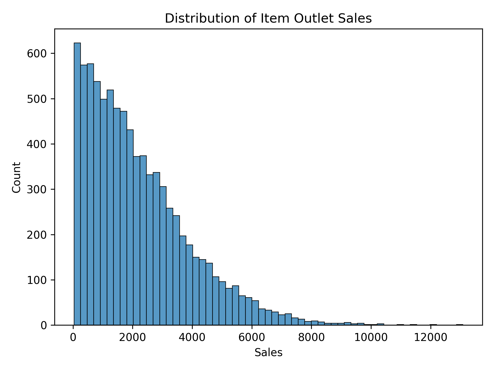
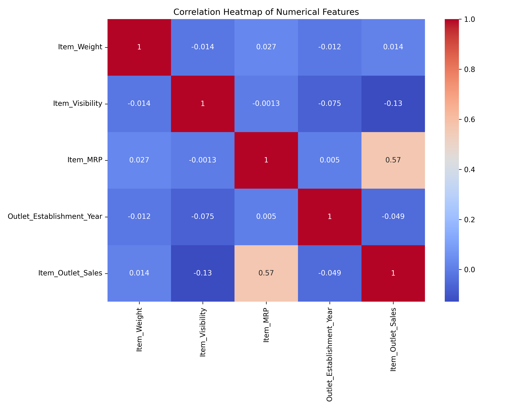

# Food Sales Prediction Project

## Project Overview
This project analyzes retail sales data to identify key factors that drive sales across various retail locations.

## Key Insights
### 1. Distribution of Item Outlet Sales

Interpretation: The distribution of sales is heavily right-skewed, indicating that while most products have moderate sales, a few high-performing items significantly drive revenue.

### 2. Feature Correlation Heatmap

Interpretation: There is a moderate positive correlation between Item_MRP and Sales, suggesting that price is a key driver of total income.
